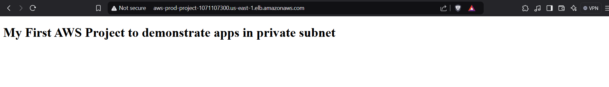

# Highly Available & Secure AWS VPC for Production Workloads

## Architecture Diagram
Below is the architecture diagram of the entire setup, showcasing how different AWS components interact:

## About the Project
I recently designed and implemented a custom AWS VPC to host production servers with a focus on **high availability**, **security**, and **scalability**. This setup ensures resiliency across multiple Availability Zones while maintaining secure access and efficient traffic handling.

## Key Components
- **VPC** – Custom network with properly segmented subnets.
- **Private & Public Subnets** – Private for secure server deployment, public for controlled access.
- **Auto Scaling Group** – Ensures high availability by dynamically scaling instances.
- **Application Load Balancer (ALB)** – Distributes incoming traffic across multiple servers.
- **NAT Gateway** – Allows private instances to access the internet securely.
- **Bastion Host** – Provides secure SSH access to private instances.

## Implementation Steps

### 1️⃣ **Created the VPC with private and public subnets across two Availability Zones**
   - Created a custom **VPC**.
   - Defined **private** and **public subnets** in two Availability Zones for high availability.
   - Set up routing tables to ensure the proper flow of traffic.

   

### 2️⃣ **Created Launch Templates for EC2 Instances**
   - Created **Launch Templates** to standardize the configuration for EC2 instances, including instance type, AMI, key pairs, and security groups.

   

### 3️⃣ **Configured Auto Scaling Group (ASG) Using Launch Templates**
   - Set up an **Auto Scaling Group** using the Launch Templates to automatically scale EC2 instances based on traffic load.
   - Ensured the instances could scale horizontally for fault tolerance and high availability.

   

### 4️⃣ **Deployed EC2 Instances Inside Private Subnets**
   - Launched EC2 instances within the **private subnets** for security.
   - SSHed into the instances to configure and validate deployment.

   

### 5️⃣ **Created a Bastion Host for Secure SSH Access**
   - Deployed a **Bastion Host** in the **public subnet** to provide secure SSH access to the private instances.
   - Configured appropriate security group rules for access.

### 6️⃣ **Deployed a Simple Web Server (index.html) to the EC2 Instance**
   - Created and uploaded a simple **index.html** file to the EC2 instance.
   - Ran `python -m http.server 8000` to host the file on port 8000.

### 7️⃣ **Created an Application Load Balancer (ALB) and Target Group**
   - Set up an **Application Load Balancer** to distribute incoming traffic across the EC2 instances.
   - Created a **Target Group** to register the EC2 instances and ensure they handle traffic correctly.

   

### 8️⃣ **Verified the Application**
   - Ensured that the **ALB** correctly distributed traffic to EC2 instances.
   - Accessed the web server through the ALB's DNS name to verify that the **index.html** was served correctly.

   

This project strengthened my hands-on experience with **AWS networking**, **security best practices**, and **high-availability architecture design**.
